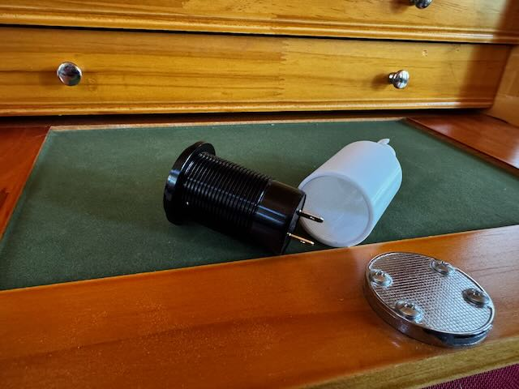
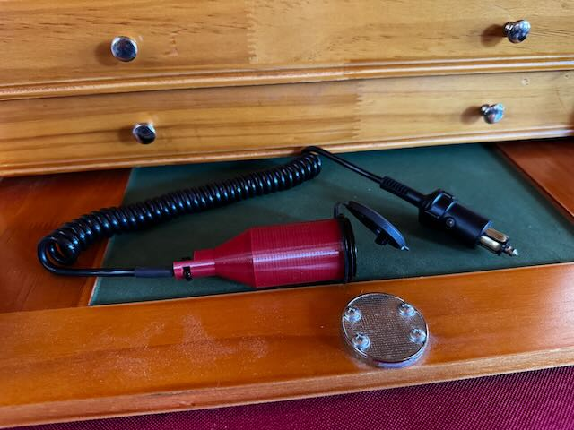

# Panel Mount Charger Case

I had a situation where I needed a charger in my motorcycle tank bag for my phone and other small electronics.  
I already had on hand a USB-C/A 12v panel mount charger, so I built this case to screw on to the bottom of that 
charger.  The case provides protection to the wires connecting in the back and a spot to put a zip tie for
wire strain relief.  

I tested the case with a few 12volt panel mount adapters and it worked with them, so I imagine the threads and the 
opening size are somewhat standard.

## Printing the Case

Because of the threads, if I used a 0.12 layer height.  Using a 0.2 layer height did not result in clean prints.
I used PETG since it will be going into a hot motorcycle tank bag.  Should work fine in PLA, just be aware of your
use case.

## Customization and Dependencies 

This model is built using the tools listed below. Install these tools and you can open up the SCAD file in this repo to create your own printable object.

- [OpenSCAD](https://openscad.org)
- [The Belfry OpenScad Library, v2.0.](https://github.com/BelfrySCAD/BOSL2)

Most of the model is parameter driven, but there may be changes needed around the strain relief area depending on what changes you make.

The `*.3mf` file in this repo is a [Orca Slicer](https://orcaslicer.com) project files used to print the model on our Bambulab  A1 mini.

## Example Output
The white part is the printed part, the black component is what is being used in the case.

Here is the final product after I wired everything up.

